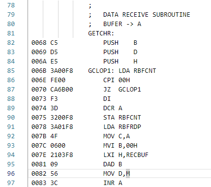
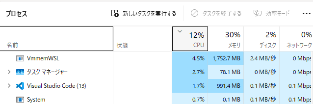
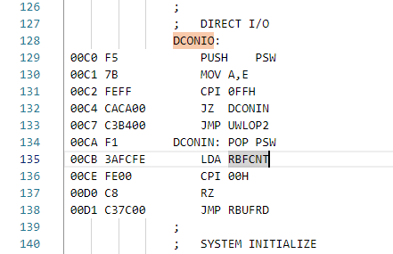
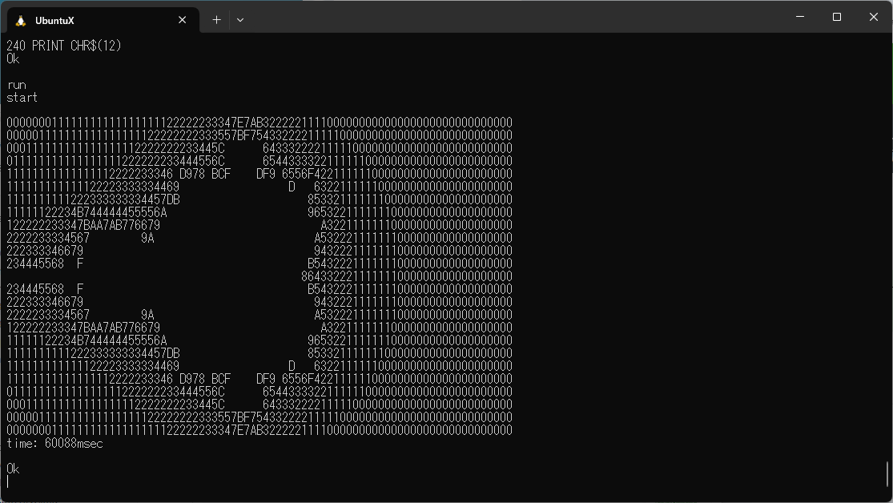
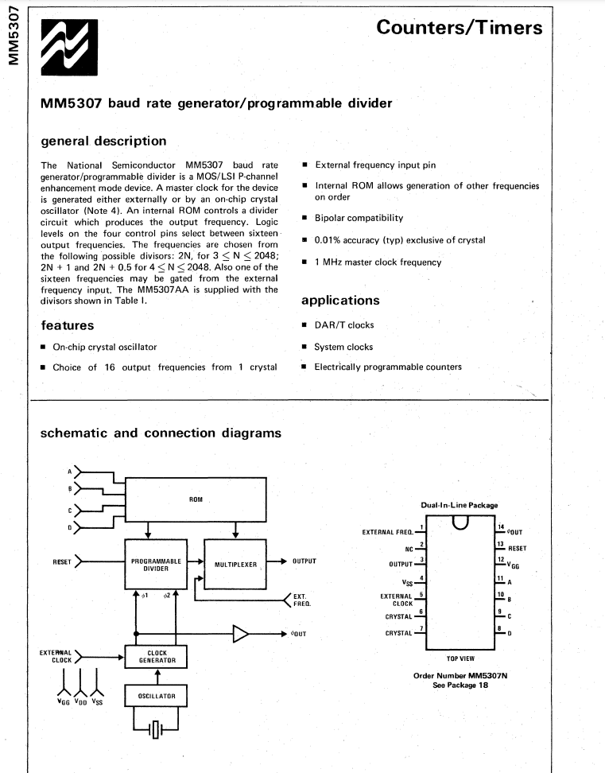

### zexall.lua

zexall というマシンがあるらしい。

```
TANDALONE = true

CPUS["Z80"] = true

MACHINES["Z80DAISY"] = true

function standalone()
    files{
        MAME_DIR .. "src/zexall/main.cpp",
        MAME_DIR .. "src/zexall/zexall.cpp",
        MAME_DIR .. "src/zexall/zexall.h",
        MAME_DIR .. "src/zexall/interface.h",
    }
end
```

ということで、簡単なハードウェアならこれだけのファイルで構成できるようだ。

SDL2を使わずにシリアルI/Oだけで構成できれば良いのだが。

src/zexall/zexall.cpp がメモリマップ, CPU(Z80)定義を持つ。

```
  This is a simplified version of the zexall driver, merely as an example for a standalone
  emulator build. Video terminal and user interface is removed. For full notes and proper
  emulation driver, see src/mame/homebrew/zexall.cpp.
```

ということで、フルバージョンは src/mame/homebrew/zexall.cpp だそうな。

## まっさらな環境でビルド(11/21)

```
cat xxx |sed -n 's/^.*undefined references* to //p' |sort -u
`emulator_info::display_ui_chooser(running_machine&)'
`emulator_info::draw_user_interface(running_machine&)'
`emulator_info::frame_hook()'
`emulator_info::get_bare_build_version()'
`emulator_info::get_build_version()'
`emulator_info::layout_script_cb(layout_file&, char const*)'
`emulator_info::periodic_check()'
`emulator_info::sound_hook()'
`emulator_info::standalone()'
`emulator_info::start_frontend(emu_options&, osd_interface&, std::vector<std::__cxx11::basic_string<char, std::char_traits<char>, std::allocator<char> >, std::allocator<std::__cxx11::basic_string<char, std::char_traits<char>, std::allocator<char> > > >&)'
```

ちょっと違う気もする。git pull origin test2 のあとビルドすると mame バイナリができていた(エラーなのでxが付かない。実行できない)が、まっさらな環境で git clone https://github.com/tendai22/mame-test mame-test2 してからビルドすると上記のようになった。

undefined が emulator_info クラスのみとなり、きれいに勘所を押さえられた気がする。よしよし。

## emulator_info を整える。

emulator_info を抹消するよりは、復活させて sdl の renderer /input を削除したほうがよいだろう。emulator_info を調べる。

class emulator_info は main.h で宣言されている。main.h で宣言されているメンバ関数のほとんどは上記 undefined メッセージに出てきている。

#### emulator_info::display_ui_chooser(running_machine&)'

src/frontend/mame/mame.cpp と src/zexall/main.cpp で定義されている。

sec/zexall は面白い。zexall はどうやら Z80エミュレータテスト環境らしく、256byte RAMだけを搭載したシステムをエミュレートしている。これ単体で動作できれば目標達成できる。

#### emulator_info::draw_user_interface(running_machine&)'

video.cppで参照され、
src/frontend/mame/mame.cpp と src/zexall/main.cpp で定義されている。

#### emulator_info::frame_hook()'

video.cppで参照され、
src/frontend/mame/mame.cpp と src/zexall/main.cpp で定義されている。

#### emulator_info::get_bare_build_version()'

auditmenu.cppで参照され、
src/frontend/mame/mame.cpp と src/zexall/main.cpp で定義されている。

#### emulator_info::get_build_version()'

参照箇所多数、
src/frontend/mame/mame.cpp と src/zexall/main.cpp で定義されている。

#### emulator_info::layout_script_cb(layout_file&, char const*)'

rendlay.cppで参照され、
src/frontend/mame/mame.cpp と src/zexall/main.cpp で定義されている。

#### emulator_info::periodic_check()'

video.cpp, debugcpu.cppで参照され、
src/frontend/mame/mame.cpp と src/zexall/main.cpp で定義されている。

zexallでの定義は空関数。

#### emulator_info::sound_hook()'

sound.cppで参照され、
src/frontend/mame/mame.cpp と src/zexall/main.cpp で定義されている。

zexallでの定義は空関数。

#### emulator_info::standalone()'

video.cpp, drawnone.cppで参照され、
src/frontend/mame/mame.cpp と src/zexall/main.cpp で定義されている。

zexallでの定義はreturn trueのみ。

#### emulator_info::start_frontend

```
emulator_info::start_frontend(emu_options&, 
    osd_interface&, 
    std::vector<std::__cxx11::basic_string<char, std::char_traits<char>, std::allocator<char> >,
    std::allocator<std::__cxx11::basic_string<char, std::char_traits<char>, std::allocator<char> > > >&)
```

* src/frontend/mame/mame.cpp で定義、引数違いの2種類が定義されている(argsのみの３引数と、argc, argvの４引数)。
* macmain.cpp, sdlmain.cpp で呼び出される。3引数版のみ。
* src/zexall/main.cpp で定義されている。引数違いの2種類が定義されている。

ここを調べれば、argc, argv から args を生成する方法もわかるだろう。

## zexall のみでビルドしたほうがよさそう。

zexallの main.cpp を見ると、シングルボードコンピュータの勘所が定義されている。

CPU, RAMサイズとメモリマップ、それら情報でコンストラクタを起動しているだけという単純さ。これが mame のフレームワークの勘所なのだろう。

zexallだけでビルドして、不要なソースをそぎ落とし、 SDLを切り落として tty ドライバで入出力を繋ぎ変えると mame フレームワークのシリアル I/O 化ができるだろう。

rc2014 は bus 構成となっており複雑で、あまりよろしくなかったことに気づいた。遠回りをしたが、ようやく先が見える道にたどり着いたような気がする。

## src/zexall/main.cpp をビルドするconfigurationを探す。

src/frontend/mame/mame.cpp は frontend を切り離したので当然 undefinedになる。

src/zexall/main.cppは組み込まれていないのだろう。これを組み込む方法を考えよう。 

## mame.lstのエントリを zexall のみとする。

ビルド結果、undefined に加えて、 driver_zexall が出た。

```
`driver_zexall'
`emulator_info::display_ui_chooser(running_machine&)'
`emulator_info::draw_user_interface(running_machine&)'
`emulator_info::frame_hook()'
`emulator_info::get_bare_build_version()'
`emulator_info::get_build_version()'
`emulator_info::layout_script_cb(layout_file&, char const*)'
`emulator_info::periodic_check()'
`emulator_info::sound_hook()'
`emulator_info::standalone()'
`emulator_info::start_frontend(emu_options&, osd_interface&, std::vector<std::__cxx11::basic_string<char, std::char_traits<char>, std::allocator<char> >, std::allocator<std::__cxx11::basic_string<char, std::char_traits<char>, std::allocator<char> > > >&)'
```

zexall.lua がスキャンされた気がしない。lua 関連も見る。

ふる mame 環境で、

```
$ find . -name zexall*
./src/mame/homebrew/zexall.cpp
./src/zexall
./src/zexall/zexall.z80
./src/zexall/zexall.h
./src/zexall/zexall.cpp
./scripts/target/zexall
./scripts/target/zexall/zexall.lua
$
```

この結果は mame, mame-test2 で変わらなかったが、src/mame/homebrew/zexall.cpp がなかった。これを追加する。

src/zexall/zexall.cppに、

```
  This is a simplified version of the zexall driver, merely as an example for a standalone
  emulator build. Video terminal and user interface is removed. For full notes and proper
  emulation driver, see src/mame/homebrew/zexall.cpp.
```

とあるので、今回の mame build では、「video terminal も user interfaceもある」zexall.cpp が必要なのかも。

## src/frontend/mame/mame.cpp

## TARGET = zexall

SCRIPTS に実行スクリプトを追加する方法として、

TARGET = zexall を定義することがありそうだ。これで、

```
# A filter file can be used as an alternative
SCRIPTS += scripts/target/$(TARGET)/$(SUBTARGET_FULL).lua
```

してくれそうだから。

## ビルドできた。

TARGET = zexall

だけでビルドできた。これはフルmameでも可能かも。

実際には、
* makefile: TARGET = zexall
* src/target/zexall/main.cppに`#include "main.h"`, `bool display_ui_chooser`が必要だった。これで trueを返したが、trueを返していいかどうかは調査必要。
* -lbgfx がないと怒られた。これも `sh erase_lopts.sh`を改造して無理やりzexall.makeから消した。

これでビルドできて、それらしく起動したが、その後の使い方がわからなかった。SDL画面は出なかった。いい感じである。

## 素の mame で zexall をビルドする。

* 実行可能バイナリ zexall ができた。
* 実行するとそれなりに起動する。
* 黒画面窓と、デバッグウインドウのようなものが表示できる。
* RAMイメージ・レジスタ情報・逆アセンブルリストがみられる。
* メニューでシングルステップ・Z80実行ができる。

これが使えれば十分ではないか、という気もするが、別のマシンのwslでビルド・実行すると、全画面黒窓のみでデバッグウインドウが表示されない、キー入力を受け付けている様子がない。これでは開発がつらい。

* 起動画面でシリアルコンソールが出せるようにしたい。
* 黒画面を小さく出したい。

やはり、frontend除去環境(test2ブランチ)で、「起動端末でシリアルIO出す」「Z80リセット(実行開始)・RAMイメージロード」ができるようにしたい。

## zexall パッケージ

* makefile で`TARGET=zexall`指定してビルドすると生成できる。
* scripts/target/zexall/zexall.lua でソースファイルを指定する。

```
    MAME_DIR .. "src/zexall/main.cpp",
    MAME_DIR .. "src/zexall/zexall.cpp",
    MAME_DIR .. "src/zexall/zexall.h",
    MAME_DIR .. "src/zexall/interface.h",
```

* ソースコードは以下の6つ

```
src/mame/homebrew/zexall.cpp
src/zexall/zexall.z80
src/zexall/interface.h
src/zexall/zexall.h
src/zexall/main.cpp
src/zexall/zexall.cpp
```

* 起動後こんなメッセージを出してだんまりとなる。

```
warning_txt = -1
Z80 instruction exerciser
<adc,sbc> hl,<bc,de,hl,sp>....
```

`warning_txt = -1` はtest2ブランチしか出ない。これは、noscreens.lay の中の xml ファイルでのみ定義されている。

```
<mamelayout version="2">
    <element name="warning">
        <text string="No screens attached to the system">
            <color red="1.0" green="0.5" blue="0.5" />
        </text>
    </element>
    <view name="No screens attached">
        <bounds left="0" top="0" right="400" bottom="300" />
        <element name="warning_txt" ref="warning">
            <bounds xc="200" yc="150" width="400" height="25" />
        </element>
    </view>
</mamelayout>
```

## zexall でCPU制御ができる理由は？デバッグウインドウは？

options.cppにログを挟んで opts に登録されるエントリを監視した。PATH 以外はなにも出てこなかった。

```
    map(0x0000, 0xffff).ram().share("main_ram");
    map(0xfffd, 0xfffd).rw(FUNC(zexall_state::output_ack_r), FUNC(zexall_state::output_ack_w));
    map(0xfffe, 0xfffe).rw(FUNC(zexall_state::output_req_r), FUNC(zexall_state::output_req_w));
    map(0xffff, 0xffff).rw(FUNC(zexall_state::output_data_r), FUNC(zexall_state::output_data_w));
    //map(0x0, 0x0).rw(FUNC(zexall_state::output_data_r), FUNC(zexall_state::output_data_w));
```

メモリアクセス関数を見て、output_rec_r, w にfprintfを入れて 0xfffe にinc (hl), メモリライトするZ80コードを置いてみた。

```
static const uint8_t zexall_binary[0x2189] =
{
    0x21, 0xfe, 0xff, 0x35, 0x35, 0x66, 0x12, 0x76
};
```

このコードを 0x0100 にコピーするとダメだったが、0x0000 にコピーすると、
これで fprintf 表示されたので、メモリマップドI/Oできることが分かった。

シングルステップとレジスタ表示ができないとしんどいので、今度はCPU側から追いかけてみる。

### Z80プログラムを0000番地からコピーしたら、メモリアクセスで登録関数が呼び出された。

0xfffd,fffe,ffff メモリへのアクセスは、ある関数呼び出しを起こす。今回は、その関数それぞれにメッセージ出力するfprintf関数を埋め込んだ。

 ||||
 |--|--|--|
 |FFFD|ack|shared ram with output device; z80 reads from here and considers the byte at FFFF read if this value
 |FFFE|req|shared ram with output device; z80 writes an incrementing value to FFFE to indicate that there is a byte waiting at FFFF and hence requesting the output device on the other end do something about it, until FFFD is incremented by the output device to acknowledge receipt
 |FFFF|data|shared ram with output device; z80 writes the data to be sent to output device here.  One i/o port is used, but left unemulated: <br>  0001 - bit 0 controls whether interrupt timer is enabled (1) or not (0), this is a holdover from a project of kevtris' and can be ignored.

無事、各関数が呼び出されている。これで、メモリマップI/OならばシリアルI/Oポート書き込みでバイト出力ができることがわかる。

```
kuma@LAURELEY:~/mame-test$ ./zexall
zexall_state: constructor
warning_txt = -1
machine_reset
rec_r: 00
req_w: ff
rec_r: ff
req_w: fe
rec_r: fe
^Z
[1]+  Stopped                 ./zexall
kuma@LAURELEY:~/mame-test$ kill -HUP %1

[1]+  Stopped                 ./zexall
kuma@LAURELEY:~/mame-test$
[1]+  Hangup                  ./zexall
kuma@LAURELEY:~/mame-test$
```

zexall 終了が簡単ではない。どのキーをたたいても何も生じない。シグナルも切られているようだ。

`std::system("stty -a");` をプログラム先頭に挟み込んで調べると。

```
kuma@LAURELEY:~/mame-test$ ./zexall
zexall_state: constructor
speed 38400 baud; rows 35; columns 135; line = 0;
intr = ^C; quit = ^\; erase = ^?; kill = ^U; eof = ^D; eol = <undef>; eol2 = <undef>; swtch = <undef>; start = ^Q; stop = ^S;
susp = ^Z; rprnt = ^R; werase = ^W; lnext = ^V; discard = ^O; min = 1; time = 0;
-parenb -parodd -cmspar cs8 -hupcl -cstopb cread -clocal -crtscts
-ignbrk -brkint -ignpar -parmrk -inpck -istrip -inlcr -igncr icrnl ixon -ixoff -iuclc -ixany -imaxbel -iutf8
opost -olcuc -ocrnl onlcr -onocr -onlret -ofill -ofdel nl0 cr0 tab0 bs0 vt0 ff0
isig icanon iexten echo echoe echok -echonl -noflsh -xcase -tostop -echoprt echoctl echoke -flusho -extproc
warning_txt = -1
machine_reset
rec_r: 00
req_w: ff
rec_r: ff
req_w: fe
rec_r: fe
```

icanon がONなのでRAWモードになっていない。Ctrl-Cは効いていないが、Ctrl-\を与えるとQuit (core dumped)した。

## シリアルI/Oどうするか。

以前 Musashi 68000 simulator でやったこと。

* raw モード(-icanon, -iecho のみ)
* 上位層、下位層
* kbhit で 1ms ディレイを入れた

Musashi の osd_linux.c を持ってきてそのまま使う。

osd_linux.c では、ttyデバイスのI/OとレジスタR/Wを非同期に行うようになっている。update_user_input(), output_device_update()をuart_dreg_r, uart_creg_r では最初に置き、uart_dreg_wでは最後に置くようにした。 

## emuz80 を起こす。

Z80 の IOPORT アクセスの方法も割り込みもわかっていないので、メモリマップドI/O でポーリングのみの emuz80 を動かしてみよう。電脳伝説さん作の BASIC を起動して ASCIIART をデモするのが目標となる。

* zexall をコピーして emuz80 を起こす。
* zexall.lua をコピーして emuz80.lua を作る。
* makefile に TARGET = emuz80 と書き換える。

```
src/emuz80
src/emuz80/osd_linux.c
src/emuz80/osd.h
src/emuz80/interface.h
src/emuz80/emuz80.h
src/emuz80/main.cpp
src/emuz80/emuz80.cpp
scripts/target/emuz80
scripts/target/emuz80/emuz80.lua
ASCIIART.BAS
```

これでビルド・起動できた。

## シリアルコンソール

```
E000: control register
  bit0: RXRDY
  bit1: TXRDY
E001: data register
  R: input
  W: output
```

EMUZ80のデータパックにある、HELLO.TXT(文字列出力後、入力キーをエコーバックする)を ROMイメージ(emuz80.h のバイト配列 emuz80_minary[])にコピペしてビルド、実行すると、確かに「文字列出力後、エコーバック」で動作した。

## EMUBASIC を動かす。

EMUZ80のデータパックにある、EMUBASIC.TXTをコピペしてビルドして起動する。最初に腐った文字を出力後、BASIC の起動文字列が表示された。

```
kuma@LAURELEY:~/mame-test$ ./emuz80
emuz80_state: constructor
warning_txt = -1
machine_reset

Z80 BASIC Ver 4.7b
Copyright (C) 1978 by Microsoft
24190 Bytes free
Ok
```

PIC18F47Q43の時のように3790 Byte free でない。さすが 64kB RAM マシンだ。


## リターンが効かない

キー入力をデバッグ出力してみた。コントロールキーだけを16進数で出すと、LF(0x0a)を返している。CR(0x0d)でないとBASICインタプリタは動かないようだ。

stty の設定が ICRNL ビットが立っていた。これをクリアすることでリターンが効いてLIST, RUNでOKを返すようになった。

## バックスペースが効かない

出力ルーチンにprintfを挟んで実行させてみると、0x08を出すべきところが0x00を出力してきていた。取り急ぎ

* 入力データの 0x7f を 0x08 に変換してエミュレータに食わせるように、
* 出力データの 0x00 を 0x08 に変換して出力するように

入出力ルーチンに鼻薬を効かせたところ、行編集表示はできているようだ。

ただし、行頭で DEL キーをたたくと、1行下にカーソルが移動する。

## 先頭1文字目のごみ、

多分、マジック文字0xe5 なのだろう。未確認。

## 高速化、

Z80生成時のクロックを20MHz, 40Mhz にしてみた。確かに早くなるが、20MHz で 60sec まで速くなっている気がしない。まだ実測していない。

output_device_update() 内で、1文字送信してからTXDレジスタが空になるまでの時間を1msecとしている。これを1/10 したら確かに少し速くなった気がする。

しかし、クロックを変えると速度が変わるというのはなかなかにすごいことではないか。

とりあえず、emuz80 はいったん完成とする。

## 残件

シングルボードコンピュータとしてアセンブリ言語プログラム開発に使うには、

* シングルステップ・ブレークポイント
* 入力ファイルの引数渡し

がまだ足りない。デバッガ周りの調査が必要。

そもそも、

* exit ができない、現状の SIGQUIT で強引に停止

ではみっともなさすぎる。

その前に、いったん原稿リポジトリを起こして書き始めることにしよう。

## 現時点のusage

一晩明けて使い方がわからなくなったのでメモを残す。

* ブランチ `rm_SDL`
* ビルドは `make -j9` + `sh erace_lopts.sh`
* 起動は `./emuz80`
* ASCIIART.BAS ファイルロードは、キー'`Ctrl-O`'を叩く。

## 原稿リポジトリ `narrowEX1`

「Octalのほそ道 外伝1『mameを砕く者』」の原稿リポジトリを起こした。narrowroad3 ファイルをコピーして、github.com/tendai22/narrowEX1.git リポジトリを作成し、README.md を書き換えた状態にある。

大体の章立てまでまとめた。

## docs_ja/memory_ja.md

memory.rst を和訳した。I/O port の名前が見える。Z80 I/O命令のアクセス先を実現する方法があるかもしれない。

## I/Oポート: z80dev.cpp を読む。

memory.rst/memory_ja.md をざっと読んで、すこしイメージが見えてきた。

デバイス`z80dev`がI/Oポートの定義方法をそこそこ書いているように見える。

```
void z80dev_state::io_map(address_map &map)
{
    map.unmap_value_high();
    map.global_mask(0xff);
    map(0x20, 0x20).portr("LINE0");
    map(0x21, 0x21).portr("LINE1");
    map(0x22, 0x22).portr("LINE2");
    map(0x23, 0x23).portr("LINE3");
    map(0x20, 0x25).w(FUNC(z80dev_state::display_w));

    map(0x13, 0x13).r(FUNC(z80dev_state::test_r));
}
```

```
void z80dev_state::z80dev(machine_config &config)
{
    /* basic machine hardware */
    Z80(config, m_maincpu, 4_MHz_XTAL);
    m_maincpu->set_addrmap(AS_PROGRAM, &z80dev_state::mem_map);
    m_maincpu->set_addrmap(AS_IO, &z80dev_state::io_map);

    /* video hardware */
    config.set_default_layout(layout_z80dev);
}
```

* z80dev で CPU の初期化とともに、io_map ハンドラを与えているようだ。
* io_map メンバ関数内で I/Oアドレスにポート名と関数を割り当てている。
* メンバ関数として、offset, data ペアを引数としてとるものを指定できる。

```
void z80dev_state::display_w(offs_t offset, uint8_t data)
```

この形でOKだろう。

## emuz80 で IO命令を使ってみた。

`OUT (0x20), A`(0xd3 0x20)を実行してみた。

* 関数 io_map を追加

```
void emuz80_state::io_map(address_map &map)
{
    map.unmap_value_high();
    map.global_mask(0xff);
    map(0x20, 0x25).w(FUNC(emuz80_state::display_w));
}
```

* ハンドラ関数 display_w を追加

```
void emuz80_state::display_w(offs_t offset, uint8_t data)
{
    fprintf(stderr, "io_w: %04x %02x\n", offset, data);
}
```

> アドレス+書き込みデータの組み合わせでもメンバ関数を追加できる。

* `emuz80_state::emuz80(machine_config &config)` に IOメモリマップ定義関数を追加

```
    m_maincpu->set_addrmap(AS_IO, &emuz80_state::io_map);
```

これでIO命令で呼び出されるメンバ関数display_wを登録できた。

実行結果は、

```
$ ./emuz80
emuz80_state: constructor
warning_txt = -1
machine_reset
io_w: 0000 00
io_w: 0001 01
io_w: 0002 02
```

となり、アドレス offset は、実際には map命令で追加した領域(0x20 - 0x25)内のオフセット値であることがわかった。

## 割り込み発生とベクタ乗せ

Z80の割り込みは、「INT端子をアサート(==割り込みが発生)するとデータバスに命令を乗せ、CPUはそれを読み込み実行する」である。mame の Z80 シミュレータがバスサイクルまでシミュレートしているかどうかわからない。割り込み対応について調べてみる。

ドキュメントによれば、CPUの1命令実行途中で割り込み処理を受理・開始する場合に、実行途中の命令はどうなるのか？が議論されている。初期の68000で、命令途中で割り込みを受け、その命令を再開する処理にバグがありマルチタスクOS作りに支障があったとかなんとかいう話を聞いたことを思い出した。

となると、CPUごとに割り込み処理の仕方が変わることになる。当たり前といえば当たり前だが、ここは要注意事項だな。以後、mameを個別のCPUに対応させる都度、考察する必要があることを理解した。

では、Z80の場合はどうか。CPU処理の中断、再開の処理を探す。

## z80.cpp の中断・再開処理

命令実行ループは、

```
/****************************************************************************
 * Execute 'cycles' T-states.
 ****************************************************************************/
void z80_device::execute_run()
{
    if (m_wait_state)
    {
        m_icount = 0; // stalled
        return;
    }

    while (m_icount > 0)
    {
        do_op();
    }
}
```

のようだ。`Execute 'cycles' T-states` とあるので、１命令ずつというよりは1マシンサイクルずつ実行しているということなのか。これはソースコード `cpu/z80/z80.hxx`

```
void z80_device::do_op()
{
    #include "cpu/z80/z80.hxx"
}
```

を調べて明らかにするしかなさそう。`m_wait_state` に1を代入するとループを停止することが分かったが、これが命令ごとかマシンサイクルごとかで話は変わってくる。

`void z80_device::execute_set_input(int inputnum, int state)` 関数の中で、

```
    case Z80_INPUT_LINE_WAIT:
        m_wait_state = state;
        break;
```

とあるので、これ、CPU の入力端子エミュレートからすると、マシンサイクル停止のようだ。

その上に割り込み信号の記述もある。

```
    case INPUT_LINE_IRQ0:
        // update the IRQ state via the daisy chain
        m_irq_state = state;
        if (daisy_chain_present())
            m_irq_state = (daisy_update_irq_state() == ASSERT_LINE) ? ASSERT_LINE : m_irq_state;

        // the main execute loop will take the interrupt
        break;
```

外部からは、`z80_device::execute_set_input(INPUT_LINE_IRQ0, ASSERT_LINE);` とか書くらしい。

m_irq_state が ASSERT_LINE に変わったらCPUの内部操作がどうなるかは探せなかった。

INTA の文字を見たような気がするので、そのコールバックが来たら割り込みベクタ(命令)を置くのか、それともメモリアクセスサイクルにm_irq_state を見て呼び分けるのか？その辺かな。

m_irqack_cb がINTA callback 関数らしい。用例は

```
void labtam_z80sbc_device::device_add_mconfig(machine_config &config)
    ...
    m_cpu->irqack_cb().set([this](int state) { m_map_mux |= MM_PND; });
```

ラムダ関数を登録しているように見える。この辺をまねて、コールバック呼び出しをチェックしてみるか。

### lamtab_z80sbc.cpp

Z80使用のワンボードコンピュータを見つけた気がする。src/bus/multibus の下にぶらさがっている。

> sources のURLを見ると、エストニア語の博物館ページで、NS32016搭載のUnix System V 3.0 マシンのようだ。

```
/*
 * Labtam 3000 Z80 SBC card.
 *
 * Sources:
 *  - https://arvutimuuseum.ut.ee/index.php?m=eksponaadid&id=223
 *
 * TODO:
 *  - serial
 */
/*
 * Part             Type         Function
 * ----             ----         --------
 * MCM93422PC * 3   256x4 RAM    memory mapper (8 maps of 32, 12-bit entries)
 * M5K4164ANP * 16  64x1 DRAM    128KiB main memory
 * M58725P          2048x8 SRAM  resident bus RAM
 * WD2793A-PL02                  floppy disk formatter/controller
 * Z80A CPU
 * Z80A DMA * 2                  fdc and sio dma
 * Z80A SIO/2
 * AM9513PC                      system timing controller
 * MM58167AN                     real time clock
 * AM9519APC                     universal interrupt controller
 *
 * D8203-1                       DRAM controller
 * AM2946PC * 4
 * DP8304BN
 *
 * 25MHz
 * 20MHz
 * 8MHz
 */
```

UnixマシンのHDDコントローラかな。深追いはやめる。

## z80.lst

CPUとしての挙動を記述するらしい。z80_make.py で z80.hxx に変換する。

```
macro   check_interrupts
    if (m_nmi_pending) {
        call take_nmi
    } else if (m_irq_state != CLEAR_LINE && m_iff1 && !m_after_ei) {
        call take_interrupt
    }
```

take_interrupt が結構長い。

```
macro   take_interrupt
    // check if processor was halted
    leave_halt();
    // clear both interrupt flip flops
    m_iff1 = m_iff2 = 0;
    // say hi
    // Not precise in all cases. z80 must finish current instruction (NOP) to reach this state - in such case frame timings are shifter from cb event if calculated based on it.
    m_irqack_cb(true);
    m_r++;
    {
        // fetch the IRQ vector
        device_z80daisy_interface *intf = daisy_get_irq_device();
        m_tmp_irq_vector = (intf != nullptr) ? intf->z80daisy_irq_ack() : standard_irq_callback(0, m_pc.w);
        LOGMASKED(LOG_INT, "single INT m_tmp_irq_vector $%02x\n", m_tmp_irq_vector);
    }
    // 'interrupt latency' cycles
    + 2
    // Interrupt mode 2. Call [i:databyte]
    if (m_im == 2) {
        // Zilog's datasheet claims that "the least-significant bit must be a zero."
        // However, experiments have confirmed that IM 2 vectors do not have to be
        // even, and all 8 bits will be used; even $FF is handled normally.
        // CALL opcode timing
        + 5
        TDAT = PC;
        call wm16_sp
        m_tmp_irq_vector = (m_tmp_irq_vector & 0xff) | (m_i << 8);
        TADR = m_tmp_irq_vector;
        call rm16
        PC = TDAT;
        LOGMASKED(LOG_INT, "IM2 [$%04x] = $%04x\n", m_tmp_irq_vector, PC);
    } else if (m_im == 1) {
        // Interrupt mode 1. RST 38h
        LOGMASKED(LOG_INT, "'%s' IM1 $0038\n", tag());
        // RST $38
        + 5
        TDAT = PC;
        call wm16_sp
        PC = 0x0038;
    } else {
        /* Interrupt mode 0. We check for CALL and JP instructions,
           if neither of these were found we assume a 1 byte opcode
           was placed on the databus */
        LOGMASKED(LOG_INT, "IM0 $%04x\n", m_tmp_irq_vector);

        // check for nop
        if (m_tmp_irq_vector != 0x00) {
            if ((m_tmp_irq_vector & 0xff0000) == 0xcd0000) {
                // CALL $xxxx cycles
                + 11
                TDAT = PC;
                call wm16_sp
                PC = m_tmp_irq_vector & 0xffff;
            } else if ((m_tmp_irq_vector & 0xff0000) == 0xc30000) {
                // JP $xxxx cycles
                + 10
                PC = m_tmp_irq_vector & 0xffff;
            } else if ((m_tmp_irq_vector & 0xc7) == 0xc7) {
                // RST $xx cycles
                + 5
                TDAT = PC;
                call wm16_sp
                PC = m_tmp_irq_vector & 0x0038;
            } else if (m_tmp_irq_vector == 0xfb) {
                // EI cycles
                + 4
                ei();
            } else {
                logerror("take_interrupt: unexpected opcode in im0 mode: 0x%02x\n", m_tmp_irq_vector);
            }
        }
    }
    WZ = PC;
    #if HAS_LDAIR_QUIRK
        // reset parity flag after LD A,I or LD A,R
        if (m_after_ldair) F &= ~PF;
    #endif
```

`m_tmp_irq_vector` を見ている。callback の中で、ここに 0xff を入れればいいのかな？

いや、`take_interrupt` の最初に

```
        // fetch the IRQ vector
        device_z80daisy_interface *intf = daisy_get_irq_device();
        m_tmp_irq_vector = (intf != nullptr) ? intf->z80daisy_irq_ack() : standard_irq_callback(0, m_pc.w);
        LOGMASKED(LOG_INT, "single INT m_tmp_irq_vector $%02x\n", m_tmp_irq_vector);

```

とあるから、`standard_irq_callback` で 0xff を返すとよさそうだ。これで、`m_tmp_itq_vector` に 0xff が代入される。

`standard_irq_callback` は、 `src/emu/diexec.cpp` で定義されている。

```
//-------------------------------------------------
//  standard_irq_callback - IRQ acknowledge
//  callback; handles HOLD_LINE case and signals
//  to the debugger
//-------------------------------------------------

int device_execute_interface::standard_irq_callback(int irqline, offs_t pc)
{
    // get the default vector and acknowledge the interrupt if needed
    int vector = m_input[irqline].default_irq_callback();

    if (VERBOSE) device().logerror("standard_irq_callback('%s', %d) $%04x\n", device().tag(), irqline, vector);

    // if there's a driver callback, run it to get the vector
    if (!m_driver_irq.isnull())
        vector = m_driver_irq(device(), irqline);

    // notify the debugger
    if (device().machine().debug_flags & DEBUG_FLAG_ENABLED)
        device().debug()->interrupt_hook(irqline, pc);

    return vector;
}
```

ちょっとわかりにくいですね。ここまで汎用的でなくてもよいのですが。

z80.h に `device_execution_interface` のメンバ関数として default_irq_vector が定義されている。0xff を返しているので、これでいいんじゃないかな。

この中に `fprintf(stderr, ...);` 入れて様子を見るか。

```
    // device_execute_interface implementation
    ...
    virtual u32 execute_default_irq_vector(int inputnum) const noexcept override { return 0xff; }
    ...
```

ちなみにすぐ下には、

```
    virtual void execute_set_input(int inputnum, int state) override;
```

とかもあるので、これで INT, BUSRQ などをドライブできるかも。

## 割り込み処理をまとめてみよう。

1. 周辺からZ80への割り込み通知 ... INT0 を立てる。

```
    z80_device::execute_set_input(INPUT_LINE_IRQ0, ASSERT_LINE);
```

`set_input_line(INPUT_LINE_IRQ0, state)` を使っている例が多い。

```
    m_maincpu->set_input_line(INPUT_LINE_IRQ0, m_fdc_irq || m_dma_irq);
```

これでZ80が割り込み処理を開始する。

2. Z80から周辺への割り込み受理通知 ... m_intqck_cb コールバックを呼び出す。

登録は以下のように行う。

```
    m_cpu->irqack_cb().set([this](int state) { m_map_mux |= MM_PND; });
```

3. データバスに0xffを乗せ、interrupt acknowledge サイクルに食わせる。

これは、`standard_irq_callback`の現在の動作がそうなっているのでそれを利用すればよいだろう。

割り込み受理通知は、「このコールバックが呼ばれている」ことの確認なのでZ80側の処理としてはここでやることはないが、周辺側としては、割り込み受理通知をもってINT0信号を下げる(根ゲートする)必要があるので要るだろう。

4. これとは別に、コールバックを定期的に呼び出す仕組みが必要。
  SBC8080 の場合、UART側で「キーボードが押された」ことを検出し Control Register を更新するとともに execute_set_input(INPUT_LINE_IRQ0, ASSERT_LINE) を呼び出す処理が必要。

  ここが未解決だ。(将来的に必要になる)ほかの処理も含めて、なんとか探し出さないといけない。vsync割込み？

  m_icount に適当な数(20とか30とか)を設定して、execute_run() を呼び出す側でポーリング関数を入れるか。execute_run の呼び出すノウハウを調べる。

## execute_run を呼び出す

execute_run の定義は CPU によりさまざまだ。debugger_instruction_hook を呼び出すCPUもある。

以下のような感じのものが多そうだ。

```
void capricorn_cpu_device::execute_run()
{
    do {
        if (BIT(m_flags , FLAGS_IRL_BIT)) {
            // Handle interrupt
            take_interrupt();
        } else {
            debugger_instruction_hook(m_genpc);

            uint8_t opcode = fetch();
            m_opcode_func(opcode);
            execute_one(opcode);
            offset_pc(1);
        }
    } while (m_icount > 0);
}
```

COSMACのように、LOAD/RESET/PAUSE/RUNモードを持つものがある。

## sbc8080.cpp を作る。

```
00H 8251 Data Register
01H 8251 Control Register
```

## まず割り込み動作のテスト

* INT信号をON/OFFする関数を作る。

```
void sbc8080_state::int_line(int state)
{
    fprintf(stderr, "(I%d)", state);
    m_maincpu->set_input_line(INPUT_LINE_IRQ0, state);
}
```

* リセット直前にINT をONしておく(`int_line(ASSERT_LINE)`)。
* 出力ポートに書き込んだら即INTをOFFにする。(`int_line(CLEAR_LINE)`)

* Z80 プログラム

```
0000 LD  SP, 0x8000
0003 EI
0004 JP  0x0004

0038 OUT (0x22), A
003A INC A
003B OUT (0x21), A
003D INC A
003E OUT (0x20), A
003F RET
```

* スタック初期化、割込み可能状態にして無限ループで待つ。

実行結果は以下の通り

```
sbc8080_state: constructor
warning_txt = -1
machine_reset
(I1)io_w: 0002 00
(I0)io_w: 0001 01
(I0)io_w: 0000 02
(I0)終了 (コアダンプ)
```

0038からのルーチンに飛び込んでいることがわかる。ここで、EIをDIに変更する(0xfb -> 0xf3)と、

```
sbc8080_state: constructor
warning_txt = -1
machine_reset
(I1)
```

割込みルーチンが呼び出されていないことがわかる。ということで、INTによる割り込み発生と、ベクタ 0xff による割込みルーチン呼び出しが機能していることがわかる。

> 正確には Z80がモード1で動作しているかどうかが未確認なのでベクタ0xffは怪しい。が、今のところはよいだろう。

## UART エミュレーション

emuz80 で使った osd_linux.c を使えばよいのだが、割り込み駆動とする場合、UARTレジスタを読みに行く前からキー入力到着を検出し内部的にフラグを立てておく必要がある。

問題は、「キー入力到着を検出し内部的にフラグを立てておく」処理を定期的に呼び出す仕掛けをどう作るか。

Z80 CPU の execute_run() ループの中に 100 回に1回でも呼び出せばよいかという気もする。そういうコールバックがあれば使ってみる、調べてみよう。

## execution_run() ループにコールバックを仕込む

class z80_device に execute_run_cb という名前でフックを仕込む。irqack_cb をまねる。

```
    auto execute_run_cb() { return m_execute_run_cb.bind(); }
```

class z80_device にメンバ `m_execute_run_cb` を追加する。

```
    devcb_write_line m_execute_run_cb;
```

z80_device::z80_device コンストラクタのメンバ初期化を追加、

```
    m_execute_run_cb(*this),
```

コールバック関数の登録は、`lux21056.cpp` の　`void luxor_55_21056_device::device_add_mconfig(machine_config &config)`

```
    m_maincpu->busack_cb().set(m_dma, FUNC(z80dma_device::bai_w));
```

を参考にすると、

```
    m_maincpu->execute_run_cb().set(m_tty, FUNC(tty::update_tty_status));
```

てな感じかな。

z80_device::execute_run() 内部でコールバックの呼び出しは、halt_cb の例を見ると、

```
    m_execute_run_cb(0);
```

とか1引数で execute_run() ループに書けばよさそうだ。

class tty に

```
void tty::update_tty_status(int state)
```

メンバ関数を用意しておけば、これが呼び出されると期待。

これではだめで、

* m_tty ではなくて m_maincpu (おそらく、device_t の継承が必要らしい)
* メンバ関数 update_tty_state(uint8_t) の引数が int はだめで、uint8_t が必要

とわかったようなわからないような。

```
    void update_tty_state(uint8_t state) { m_tty->update_tty_status(state); };
```
```
    m_maincpu->execute_run_cb().set(m_maincpu, FUNC(sbc8080_state::update_tty_state));
```

としてビルドできた。tty::update_tty_status の定義がないのでビルドは完了しなかったが。

これで実行すると、Late Binding エラーがでた。そりゃ、sbc8080_stateのメンバ関数を z80_device のポインタで実行しようとしてもだめでしょう。

```
    m_maincpu->execute_run_cb().set(*this, FUNC(sbc8080_state::update_tty_state));
```

これでビルドできて、tty::update_tty_status が連続して呼び出されている。

今日はここまで。明日は tty::update_tty_state で ttyデバイス監視を組み込んで様子を見る。

## tty.cpp を device_update で非同期更新できるようにした。

tty::update_tty_state -> tty::device_update と改名した。

Musashi 由来の input_device_update, output_device_update を tty_device_update でくるんだ。

## offs_t 定義を得るには #incluse "emu.h" する。

直接的には "emumem.h" で

```
using offs_t = u32;
```

しているのだが、バランス的に "emu.h" をインクルードするのがよさそうと考えた。

## callback tty_irq_cb

class tty 実装中で IRQをON/OFFしたい。`sbc8080_state::int_line(int state)` でON/OFFするのだが、この関数をclass tty 実装中で呼び出したい。

class sbc8080_state は sbc8080.cpp 内部に閉じている。ヘッダ`sbc8080.h`で定義されているわけでもない。よって、

* class tty 内部で関数ポインタを一つ持つ(tty_irq_cb)
* tty内部でIRQをON/OFFしたいときはこの関数ポインタの関数を呼び出す。
* 案1) `tty::tty_irq_cb` セット関数に `int_line` メンバ関数を渡す。
* 案2) グローバル関数を定義してコールバックとする。グローバル関数定義内部では、グローバルポインタに `sbc8080_state` オブジェクトのポインタを保存しておき、それの `int_line` メンバ関数を呼び出す。

案2でやってみた。

class tty 内で

```
    // set a callback function
    void set_irq_cb(void (*fptr)(offs_t offset, uint8_t value)) { tty_irq_cb = fptr; };
```

sbc8080.cpp 内で、グローバル関数のコールバック関数 `irq_callback` を定義する。int_line 参照のために sbc8080_state オブジェクトが必要だったので、オブジェクトポインタ `g_sbc8080` を用意した。みっともねー。

```
static sbc8080_state *g_sbc8080;

static void irq_callback(offs_t offset, uint8_t value)
{
    if (offset == IRQ_INPUT_DEVICE)
        g_sbc8080->int_line(value ? ASSERT_LINE : CLEAR_LINE);
}
```

> デバイス tty は、INPUT/OUTPUT 両方の割り込み要因を持ちうるが、ボード sbc8080 がINPUT要因のみを見てINT端子をON/OFFするので、このロジックが sbc8080.cpp 内に存在するのが正しい。

sbc8080.cpp の sbc8080_state::machine_reset 内で

```
    m_tty->set_irq_cb(irq_callback);
```

と関数 `irq_callback` を tty オブジェクトに登録する。

これでリンクエラーなしまで進んだ。

おそらく `devcb` かなにか、mame が用意したコールバックの仕掛けを使うことで、もっとエレガントに(意味のないグローバル関数ポインタを使ったりせずに)書くことができるのだろうが、まずは動けばよしのモードで、これで進める。

次は、割り込みシリアルI/OのZ80コードを実行させてみる。sbc8080データパック内にサンプルテストコードがあるので、それを使う。

## サンプルデータコード

objcopyを使ってバイナリデータにして、hdを使って16進数ダンプデータを作り、Cソースコードにした。

RAM領域が0xe000-ffffないので、SP初期化の値を8000Hに変更した。
ワークエリアをF800から使っていたので、結局RAM領域を0000,ffffとした。

以前のテスト用にリセット直後にINT0をあさーとしていた。これを外した。

これで安定するが、キー入力押してもINT lineが立たない。

結局、input_device_update 忘れ、update_user_inputで下位層(ttyドライバ)から1バイト吸い出しinput_device_readyを立てるのだが、int_lineを呼び出していなかった。

int_lineの呼び出しはinput_device_update関数でやっていたが、そこが抜けていた。

なんでこんなことしたんや。一つに統合でもええと思うんだけど。

update_user_input と input_device_update を両方入れたらキー入力を取るようになった。

```
void tty::device_update(uint8_t state)
{
    update_user_input();
    input_device_update();
    output_device_update();
}

```

しかし、応答が遅い。いろいろデバッグ出力を入れてるからやろうけど、

```
[[34]]{34}<6836720><6836740>**[34]
(I1)(I1)(I1)(I1)(I1)(I1)(I1)(I1)(I1)(I1)(I1)(I1)(I1)[S:07]
(I1)(I1)(I1)(I1)(I1)(I1)(I0)(34)[S:05]
uart_dreg_w: 34
```

(I1)が連打されるのはおかしい。要調査。

## 連打の件

`static void irq_callback(offs_t offset, uint8_t value)` で前と同じ値をIRQ_INPUT_DEVICEに書き込む場合はint_lineしないようにした。

## 応答が遅い件

update_user_input で kbhit 呼び出すところで 70us 程度かかっている。selectのタイムアウト10usだったのを1usまで減らすのと、update_user_input の呼び出しを20回に1回程度に間引くことでそこそこの速度が出ている。

selectのタイムアウト0usとすると出力文字が抜ける。

間引きを40にすると入力文字が抜ける。

Ctrl-OによるASCIIART.BAS読み込みは効かない。先頭の一部読み終えたところで切れてしまう。

MSBAS80.HEX からROMイメージを作って焼くとBASICは起動する。ただしASCIIART.BAS実行はできていない。

あと、get_msec() を get_100us() とした。効果のほどは見えない。

## tty.cpp 作り直し

* 遅い。selectタイマ 1us でも感覚的に遅い。
* selectタイマ 0us だと出力書きこぼしする。
* ASCIIART.BAS 読み込みに失敗する。最初の数行しか読み込まない。IN命令で全部舐めた後OUT命令で書き出し途中で止まる挙動が意味不明。

つらつら考えるに、

* Z80命令実行ループにフックを入れるのは速度ペナルティが多すぎ。
* 8251コントロールレジスタを読み込むときに状態更新すればよい。
* 出力だけでなく、入力もタイマ入れて「読み込み後一定時間はRxRDYを立てない」でよいのではないか。

という気がしてきた。それで作り直しとした。

今までの失敗作は bad_tty_freezed とタグをつけて土に埋めてしまった。rm_SDL ブランチ名も変なので改名して、develop ブランチで行く。

## 新tty.cppコンセプト

* 8251コントロールレジスタを読み込むときに状態更新すればよい。
* 出力だけでなく、入力もタイマ入れて「読み込み後一定時間はRxRDYを立てない」でよいのではないか。

に加えて、

* レジスタ読み込み・書き出しルーチンから呼び出せる関数群とする。
* コントロールレジスタビット割り当ては8251と独立。

* コントロールレジスタ読み込み
  + 入力ステータス更新: 前のデータレジスタ読み出し後から XXXus経つまでは受信レディビットは変化なし。XXXus経過した時点でキー入力有無チェックして、データが存在すれば読みだして保持、内部データレディと受信レディビットを更新する。
  + 出力ステータス更新: 前のデータレジスタ書き出し後から YYYus経つまでは送信レディビットに変化なし(0のまま)。
  + YYYus経過した時点で、送信データ保持していないなら、送信レディビットを更新する(1にする)。送信データレディならば内部保持データを送信してタイマを更新する。
* データレジスタ読み込み。
  + 前のデータレジスタ読み出し後から XXXus 経つまでは受信レディビットは変化なし。内部保持データを返す。
  + XXXus 経過した時点でキー入力有無チェックして、データが存在すれば読みだして保持、内部データレディと受信レディビットを更新する。
  + そのあと内部保持データを返して内部保持データ無効としてタイマをリセット(カウント開始)する。
* データレジスタ書き込み(データ送信)
  + 前の下位層書き出しから YYYus 経つまでは、内部保持データに上書きして返る。
  + YYYus 経過したら、送信データ保持していないなら、受け取ったデータを送信してタイマを開始する。内部送信データは無効、送信レディビットは0のまま。
  + 送信データを保持しているなら、内部送信データを書き出して、タイマを開始し、送信レディビットを0にする。受け取った送信データは内部送信データに保持する。
  + 送信データを保持していないなら、受け取った送信データを書き出して、タイマを開始し、送信レディビットを0にする。

## 作ってみた。

コンパイルエラーを取り動かす。割り込みがかからない。

ステータスレジスタ読み込むときに更新するようにしているが、割り込みがかからねばステータスレジスタを読まない。ということで詰んでいる。

非同期でキー入力を監視・割り込みをかける仕組みを入れないといけない。

とりあえず2案ある。

1. アドレスFF00のメモリに罠を仕掛ける。
2. キー入力があると発生する「割り込み」を使う。

### 案1. アドレスFF00を監視する

SBC8080データパックに含まれる TEST80.ASM が、割り込みシリアルI/O動作確認用のZ80プログラムである。まずこれでデバッグ・テストする。キーをたたくとエコーバックが返ってくる。

このプログラムのメインルーチンは、アドレスFF00をループして監視している。非ゼロになるとキー入力が到着してバッファにあると判断しエコーバックする。



よって、FF00読み出しアクセスの際にttyキー入力のチェックを行い、8251コントロールレジスタの値を更新してINT信号をアサートすればよいと考えられる。

特定メモリアドレスの監視だが、mame の仕組みで、特定メモリアクセスの際に呼び出す関数登録ができる。というのを使う。まずこれでやってみた。

```
    map(0xf800, 0xf800).rw(FUNC(sbc8080_state::watcher_memory_r),FUNC(sbc8080_state::watcher_memory_w));

```

Z80がメモリFF00をR/Wすると、関数 watcher_memory_r/wを呼び出す、ように仕込んだ。

関数watcher_memory_r/w では、書き込んだデータを保持して、あとで読みだしたときに返す。これしないとRAMとは言えない。そのうえで、シリアルI/Oの状態更新を行い、RXRDY が立ったら IRQ をアサートする。落ちたらネゲートする。

```
uint8_t sbc8080_state::watcher_memory_r(void)
{
    //sleep(1);
    update_int_line();
    return m_watcher_memory;
}

void sbc8080_state::watcher_memory_w(uint8_t data)
{
    m_watcher_memory = data;
}
```

> sleep(1)はデバッグ用である。FF00のリード1サイクル1秒まで引き延ばすので、レジスタダンプしながらの実行の様子を追いかけるのに見やすくなる。

update_int_line() で「シリアルI/Oの状態更新」を行っている。

```
void sbc8080_state::update_int_line(void)
{
    uint8_t status_register;
    status_register = m_tty->read_status_register();
    int status_flag = (status_register & RXRDY_Bit) != 0;
    int line_flag = (m_prev_int_line == ASSERT_LINE);
    int toggle_line = line_flag ? CLEAR_LINE : ASSERT_LINE;
    if (status_flag != line_flag) {
        int_line(toggle_line);
        m_prev_int_line = toggle_line;
        //fprintf(stderr, "(I%d)", toggle_line);
    }
}
```

RXRDYが反転するタイミングを見つけて、それに合わせて IRQ 信号線を ON/OFF している。fprintf(stderr, ...); でint_lineを呼び出したことをダンプさせている。実際に動かすと、キーをたたくと見事に"(I1)...(I0)"してエコーバックしてくれている。

手でたたく分には大丈夫そうだ。キーリピートを効かせて連続入力しても引っかかったり息をついたりしない。

ASCIIART.BAS の読み込みはRXRDYになるタイミングをある程度空けないと割り込みルーチンが吠えまくりバッファがいっぱいになったところで読み込みを止めてしまう。RXRDYが落ちてから、次にあげるまでの間を1ms程度空ける必要がありそうだ。

> 身軽な状態で実行させ、CPU使用状況を見てみた。VmmemWSLがCPUを4～5%程度使用している。ちょっと多いかなぁ。スピンさせているので仕方ないですねぇ。sbc8080 実行していないときは、VmmemWSL の消費は 1～2%程度だった。
> 
> 

## 案2: SIGIO を使う。

Unix/Linux OSでは、シグナルという仕組みがある。C言語関数を登録しておくと、何らかのイベントが発生すると、そのプロセスにシグナルが送信され、その関数が実行されるようになる。プロセス内の割り込みと考えてもよい。

シグナルが送信される先はプロセスである。

起動直後、関数登録するまでは、「シグナルを受け取るとそのプロセスは終了する」という挙動になっている。Ctrl-C や Ctrl-\ をたたくとプロセスが終了するというのも、端末ドライバがプロセスに対してシグナルを発行してプロセスが終了するという挙動の表れである。

シグナルにはいくつかの種類がある。Ctrl-C をたたくと発生するシグナルは、SIGINT であり、Ctrl-\ は SIGQUIT である。デバイスをオープンして読み込んでいるときに、データが到着すると発生するシグナルもあり、SIGIO という。sbc8080 の標準入力にデータが到着すると SIGIO というシグナルが sbc8080 に送出されるようにできると考えた。もしそうなら、「ステータスレジスタを更新し IRQ 信号線をONにする関数(上記のupdate_int_line)をシグナルハンドラとして登録すればよいことになる。

> この試行はまだできていない。本書原稿アップまでに間に合わないかもしれない。SIGIO は大昔のUnixにはなかったシグナルで、私も使ったことがないので、できるかどうかはやってみないとわからない。

## MSBAS80 を動かしてみた。

```
$ !.
./sbc8080
sbc8080_state: constructor
warning_txt = -1
machine_reset

INTEL8080 BASIC Ver 4.7b
Copyright (C) 1978 by Microsoft
32382 Bytes free
Ok
終了 (コアダンプ)
$
```

キー入力を受け付けてくれない……、当たり前や。TEST80.ASM と MSBAS80.ASM ではキー入力監視アドレスが違う。

FEFCじゃないか？



外れだった。キーたたいてもだんまりだった。

あれこれ触って、分かった。見ているプログラムリストがMON80A.PRNだった。

MSBAS80.LSTを見て、0x8043が受信バッファカウントと分かった。これを設定してうまく動いた。

## ASCIIART.BAS

ファイルからのソース読み込み。今までの入力実装では、1文字読み込んでBASICインタプリタの処理が進む前に、割り込みで次々バッファが埋まるまで読み込んでしまう。kbhit が常時trueを返す。その結果割り込みルーチンが走って入力バッファが埋まるまで読み込んでしまう。これが原因らしい。

対策は、kbhit の false 期間を設ける。1ms 程度。

調べた結果、タイマの計算式が間違っていた。

```
    if (current - m_previous_input_tick <= INPUT_TICK_PERIOD) {
```

と書くべきところを

```
    if (m_previous_input_tick - current <= INPUT_TICK_PERIOD) {
```

と書いていた。これでは時間が取れない。これを直すとソースコードを読み込むようになった。

ただし、

* エコーバックしてくれない。
* "Ok" が帰るまで時間がかかる。これはこんなもんか？

```
PRINT CHR$(11) で計時開始
PRINT CHR$(12) で計時終了、msec 単位の時間経過を印字
```

するようにして測定した。

クロック20MHzで、60088ms(60sec)、クロック3.57MHzで、335718ms(335sec)と、実機Z80クロック相当分の速度を出しているようだ。すごい。

クロック20MHz<br>

クロック3.57MHz<br>


この時点で tag v0.991 (ASCIIART.BAS忘れていたので追加したもの)

# 公開用リポジトリを用意

## ざっくり削除

本構成でビルドする際に不要なソースを削除する。

* フルビルドして "Compiling... "に出てこない *.c/*.cpp ファイルをリストアップ
* src 下のもののみをすべて消す  
  (3rdparty は "Compiling..."が出てこないが使っている/testは残しておきたい)
  (generated/ 下にあるファイルはビルド後しか存在しない)

```
mv src/tools/pngcmp.cpp src/tools/pngcmp.cpp-xx
```

的に rename して実体は残すが、ソースコードとして認識させないようにした。

## shader/glsl_general.vsh.c がない -> 足してビルド

```
Compiling src/osd/modules/opengl/gl_shader_mgr.cpp...
../../../../../src/osd/modules/opengl/gl_shader_mgr.cpp:36:10: fatal error: shader/glsl_general.vsh.c: No such file or directory
   36 | #include "shader/glsl_general.vsh.c"
```

これだけ直して再ビルドすると次のファイルで引っかかる。結局

```
$ ls -1 *.c-xx |sed 's/-xx$//' |awk '{ printf "mv %s-xx %s\n", $1, $1 }'
```

で戻して再ビルドする。

これでビルドできた。sbc8080 ができた。

## emuz80 を復活させてビルド

makefile の TARGET = emuz80 を定義してビルド。src/emuz80 が存在しなかったので復活。

ビルドして実行できたが emuz80 BASIC が動かない。ROM イメージの再調整が必要。

## v0.991 以後の更新

いくつか消しまくった

```
git rm -rf android-project
git rm -rf attic
git rm -rf artwork
git rm -rf bgfx
git rm -rf hash hlsl
```

ついに '-lbgfx' を出さないようにした。

scripts/src/mame.lua に "bgfx" オプションを指定する行があるので、それをコメントアウトした。

これでタグ v0.992 を打った。

## sbc6800, sbc6809 のマージ(タグ v0.993)

@ryu10 さんにより、本 mame-sbc を使用して sbc6800, sbc6809 が開発された。プルリクエストを頂いたので確認の上マージさせていただいた。

sbc6800, sbc6809 は電脳伝説さんのSBCである、SBC6800, SBC6809 をエミュレートしたものです。

## I8251 を使うための調査

`~/mame` 配下のフルセットmameでソースコードを漁る。

`src/devices/bus/a2bus/byte8251.cpp`: 

```
void a2bus_byte8251_device::device_add_mconfig(machine_config &config)
{
    I8251(config, m_usart, 1021800); // CLK tied to ϕ1 signal from bus pin 38
    m_usart->txd_handler().set("rs232", FUNC(rs232_port_device::write_txd));

    MM5307AA(config, m_brg, DERIVED_CLOCK(1, 8));
    m_brg->output_cb().set(m_usart, FUNC(i8251_device::write_txc));
    m_brg->output_cb().append(m_usart, FUNC(i8251_device::write_rxc));

    rs232_port_device &rs232(RS232_PORT(config, "rs232", default_rs232_devices, nullptr));
    rs232.rxd_handler().set(m_usart, FUNC(i8251_device::write_rxd));
}
```

AppleIIの 8251カードらしい。

* `I8251(config, m_usart, 1021800);`  
  m_usart を I8251デバイスで埋める。1021800はクロックだろう。
* `m_usart->txd_handler().set("rs232", FUNC(rs232_port_device::write_txd));`  
  i8251の下位層に rs232c_port_device を置ける。  
  ハンドラをセットできるらしい。8251 で TXD 書き込み時のハンドラに `rs232c_port_device::write_txd` が登録できるのだろう。第1引数が文字列の時は "rs232c" の名前で当てられるのだろう。
* `rs232_port_device &rs232(RS232_PORT(config, "rs232", default_rs232_devices, nullptr));`  
  rs232 が実体なのだろうが、write_txd ハンドラ登録は実体生成に先立って行われている。なので名前 "rs232c" で当てられるのだろうと推察。

以上まとめると、

* I8251の下側にrs232_port_device を置く。mameの場合はビデオ端末画面とキー入力につながっているのだろう。
* キー入力は、rs232_port_device 内でイベントが湧き、i8251_device::write_rxd を呼び出して上位層 I8251 につなぐ。
* ビデオ出力は、i8251_device 内でTXDレジスタ書き込みが起こり(i8251_device::txd_handlerが呼び出される)、 txd_handler の中で rs232c_port_device::write_txd が呼び出され、下位層にデータが渡される。

下位層デバイスでは、

* キー入力があれば、 `i8251_device::write_rxd` を呼び出してデータを渡す。
* 画面出力は、 `m_uart->txd_handler().set("rs232", FUNC(rs232_port_device::write_txd))` で `write_txd` を呼び出してもらうように手配し、 `write_txd` の中で画面描画を行う。

でよいのだろう。

mame-sbc では、

* I8251デバイスをメンバで作成する。
  + `device_add_mconfig` 中で `I8251(config, m_usart, 1021800);`
* ttyデバイスを自作する。  
  + `rs232_device` を参考にする。
  + `device_add_mconfig` 中で `m_usart->txd_handler().set("tty", FUNC(tty_device::write_txd));`
  + `TTY(config, m_tty, 0);`
  + `m_tty->rxd_handler().set(m_usart, FUNC(i8251_device::write_rxd));`
* rs232_device の execute_run を探して中身を参考にする。
  + 入力(rxd)検知
  + 出力バッファあふれ?フロー制御?
* i8251_device のコントロールレジスタ更新どうやる?
  + i8251_device::write_rxd で書き込んだらコントロールレジスタも自動更新される?
  + 別途コールバックがある? (i8251_device::write_txc?write_rxc?)

## i8251_device::txd_handler は 0/1bit を書き込む

`src/devices/bus/heathzenith/h89/h88_5.cpp`:

このラムダ関数から、引数は bool state となっている。いやビットに割られても困る。

```
    m_uart->txd_handler().set([this] (bool state) { m_cassbit = state; });
```

## rs232_device

`NABU PC RS232 Card` 特定マシンのRS232 Cardらしい。あまりgenericではなさそう。

```
void rs232_device::device_add_mconfig(machine_config &config)
{
    I8251(config, m_i8251, DERIVED_CLOCK(1, 2));
    m_i8251->rxrdy_handler().set(FUNC(rs232_device::rxrdy_w));
    m_i8251->txd_handler().set("rs232", FUNC(rs232_port_device::write_txd));

    PIT8253(config, m_pit8253, DERIVED_CLOCK(1, 2));
    m_pit8253->set_clk<0>(clock() / 2);
    m_pit8253->out_handler<0>().set(m_i8251, FUNC(i8251_device::write_txc));
    m_pit8253->set_clk<1>(clock() / 2);
    m_pit8253->out_handler<1>().set(m_i8251, FUNC(i8251_device::write_rxc));

    rs232_port_device &rs232(RS232_PORT(config, "rs232", default_rs232_devices, nullptr));
    rs232.rxd_handler().set(m_i8251, FUNC(i8251_device::write_rxd));
    rs232.cts_handler().set(m_i8251, FUNC(i8251_device::write_cts));
    rs232.set_option_device_input_defaults("null_modem", DEVICE_INPUT_DEFAULTS_NAME(terminal));
    rs232.set_option_device_input_defaults("terminal", DEVICE_INPUT_DEFAULTS_NAME(terminal));
}
```
 
`i8251_device::rxrdy_handler` があるらしい。

`rs232_port_device` を調べるべきだった。

## rs232_port_device

こちらが本物のシリアルポート下位層らしい。

ボーレート、データビット長、パリティ、ストップビットの設定がある。

```
    // static configuration helpers
    auto rxd_handler() { return m_rxd_handler.bind(); }
    auto dcd_handler() { return m_dcd_handler.bind(); }
    auto dsr_handler() { return m_dsr_handler.bind(); }
    auto ri_handler() { return m_ri_handler.bind(); }
    auto si_handler() { return m_si_handler.bind(); }
    auto cts_handler() { return m_cts_handler.bind(); }
    auto rxc_handler() { return m_rxc_handler.bind(); }
    auto txc_handler() { return m_txc_handler.bind(); }
```

```
    void write_txd(int state);        // DB25 pin  2  V.24 circuit 103   Transmitted data
    void write_dtr(int state);        // DB25 pin 20  V.24 circuit 108/2 Data terminal ready
    void write_rts(int state);        // DB25 pin  4  V.24 circuit 105   Request to send
    void write_etc(int state);        // DB25 pin 24  V.24 circuit 113   Transmitter signal element timing (DTE)
    void write_spds(int state);       // DB25 pin 23  V.24 circuit 111   Data signal rate selector (DTE)
```

やっぱり、ビット単位の読み書きだ。

rs232_port_interface クラス:

```
    virtual void input_txd(int state) { }
```

上位層からの送信データ通知、このクラスを派生させて実デバイスへの書き込みを使う。

```
    void output_rxd(int state) { m_port->m_rxd = state; m_port->m_rxd_handler(state); }
```

下位層から受信データ受信、内部にビットを貯めてから rxd_handler(int state) を呼び出して上位層に伝える。

ビット単位の読み書きは不要なので、使うなら i8251_device までだろう。

### class i8251_device

ハンドラ

```
    auto txd_handler() { return m_txd_handler.bind(); }
    ...
    void write_rxd(int state);
```

* `txd_handler` 上位層からの送信データ書き込み時に下位層にデータ通知
* `write_rxd` 下位層から i8251_device に受信データを通知。下位層デバイスにハンドラ登録する?でもビット単位だから今回は使えないか。

上位層(対CPU)メンバ関数?

```
    uint8_t data_r();
    void data_w(uint8_t data);
    uint8_t status_r();
    void control_w(uint8_t data);
```

これは仮想関数ではない。i8251_device::data_r 定義が呼び出される。これを1バイトずつマッピングしても動きそう。

```
    virtual uint8_t read(offs_t offset);
    virtual void write(offs_t offset, uint8_t data);
```

これは仮想関数。これが Z80 の io_mem でマッピングされる関数かな。

```
// device type definition
DECLARE_DEVICE_TYPE(I8251,   i8251_device)
```

最後にこれがあるので、`I8251()` 関数呼び出しでデバイスが生成・登録されるのかな。

`src/device/machine/i8251.cpp`

```
void i8251_device::update_rx_ready()
{
    int state = m_status & I8251_STATUS_RX_READY;

    // masked?
    if (!BIT(m_command, 2))
        state = 0;

    m_rxrdy_handler(state != 0);
}
```

`update_rx_ready`: m_status を m_rxrdy_handler で通知する。

`receive_character` という関数がある。受信データ全ビット受信後に呼び出される。

```
/*-------------------------------------------------
    receive_character - called when last
    bit of data has been received
-------------------------------------------------*/

void i8251_device::receive_character(uint8_t ch)
{
    LOG("receive_character %02x\n", ch);

    m_rx_data = ch;

    LOGSTAT("status RX READY test %02x\n", m_status);
    /* char has not been read and another has arrived! */
    if (m_status & I8251_STATUS_RX_READY)
    {
        m_status |= I8251_STATUS_OVERRUN_ERROR;
        LOGSTAT("status overrun set\n");
    }

    LOGSTAT("status pre RX READY set %02x\n", m_status);
    m_status |= I8251_STATUS_RX_READY;
    LOGSTAT("status post RX READY set %02x\n", m_status);

    update_rx_ready();
}
```

`data_r` : io_mem でマップするハンドラっぽい。

`side_effects_disabled()` って何だろうか?

```
uint8_t i8251_device::data_r()
{
    LOG("read data: %02x, STATUS=%02x\n",m_rx_data,m_status);
    /* reading clears */
    if (!machine().side_effects_disabled())
    {
        m_status &= ~I8251_STATUS_RX_READY;
        LOGSTAT("status RX_READY cleared\n");
        update_rx_ready();
    }
    return m_rx_data;
}
```

`read(ofs_t offset)` : 複数バイトをマッピングするための関数だ。

```
uint8_t i8251_device::read(offs_t offset)
{
    if (offset)
        return status_r();
    else
        return data_r();
}
```

`control_w`, 事実上 command_w 呼び出し。

```
void i8251_device::control_w(uint8_t data)
{
    if (m_flags == I8251_NEXT_SYNC1)
        sync1_w(data);
    else
    if (m_flags == I8251_NEXT_SYNC2)
        sync2_w(data);
    else
    if (m_flags == I8251_NEXT_MODE)
        mode_w(data);
    else
        command_w(data);
}

```

`command_w` でかい。

```
void i8251_device::command_w(uint8_t data)
{
    /* command */
    m_command = data;

    LOG("I8251: Command byte: %02x\n", data);
    LOGCOM(" Tx enable: %d\n", data & 0x01 ? 1 : 0); // bit 0: 0 = transmit disable 1 = transmit enable
    LOGCOM(" DTR      : %d\n", data & 0x02 ? 1 : 0); // bit 1: 0 = /DTR set to 1    1 = /DTR set to 0
    LOGCOM(" Rx enable: %d\n", data & 0x04 ? 1 : 0); // bit 2: 0 = receive disable  1 = receive enable
    LOGCOM(" Send BRK : %d\n", data & 0x08 ? 1 : 0); // bit 3: 0 = normal operation 1 = send break character
    LOGCOM(" Err reset: %d\n", data & 0x10 ? 1 : 0); // bit 4: 0 = normal operation 1 = reset error flag
    LOGCOM(" RTS      : %d\n", data & 0x20 ? 1 : 0); // bit 5: 0 = /RTS set to 1    1 = /RTS set to 0
    LOGCOM(" Reset    : %d\n", data & 0x40 ? 1 : 0); // bit 6: 0 = normal operation 1 = internal reset
    LOGCOM(" Hunt mode: %d\n", data & 0x80 ? 1 : 0); // bit 7: 0 = normal operation 1 = hunt mode

    m_rts_handler(!BIT(data, 5));
    m_dtr_handler(!BIT(data, 1));

    if (BIT(data, 4))
    {
        LOGSTAT("status errors are reset\n");
        m_status &= ~(I8251_STATUS_PARITY_ERROR | I8251_STATUS_OVERRUN_ERROR | I8251_STATUS_FRAMING_ERROR);
    }

    if (BIT(data, 6))
    {
        // datasheet says "returns to mode format", not
        // completely resets the chip.  behavior of DEC Rainbow
        // backs this up.
        m_flags = I8251_NEXT_MODE;
    }

    // Hunt mode
    m_hunt_on = false;
    update_syndet(false);
    if (m_sync_byte_count)
        m_hunt_on = BIT(data, 7);
    if (m_hunt_on)
        m_ext_syn_set = false;

    if (BIT(data, 3))
        m_txd_handler(0);

    check_for_tx_start();
    update_rx_ready();
    update_tx_ready();
    update_tx_empty();
}
```

* m_command に書き込まれたデータを保持
* hunt mode は同期モードで使うらしい。
* BIT3 on のとき、"Send BRK", m_txd_handler(0)を呼び出す。確かにTXDをゼロにするのだから。
* あとは、check_for_tx_start(), update_rx_ready, update_tx_ready, update_tx_empty を呼び出す。

### i8251_device まとめ

i8251_device 自体は、定期的に呼び出されるメンバ関数はなさそう。

`receive_character(uint8_t ch)`が、下位層からのデータ到着通知に使用できる。下位層へのデータ書き込みは、`data_w(uint8_t data)` を map しておけば、データレジスタアクセス時に必要な処理を全部やってくれる。

よって、tty データ到着をチェックして、到着していれば1バイト読んで `receive_character(uint8_t ch)` で通知する関数を作り、別途定期的に呼び出す仕組みの導入が必要だ。

`receive_character` は `receive_clock` の中で呼び出されている。なので、`receive_clock` を定期的に呼び出す仕組みを探す。

`write_clock` は `write_rxc` の中で呼び出されいる。`write_rxc` を調べる。

### 定期的呼び出し方法を探す。

`src/devices/machine/ym2148.cpp` には `TIMER_CALLBACK_MEMBER` がある。これを使うか。

```
TIMER_CALLBACK_MEMBER(ym2148_device::serial_clock_tick)
{
    receive_clock();
    transmit_clock();
}
```

`TIMER_CALLBACK_MEMBER` はマクロで、s32型の引数1個を取る関数を宣言する。

```
#define TIMER_CALLBACK_MEMBER(name)     void name(s32 param)
```

s32 は `src/emu/attotime.h:typedef s32 seconds_t;` seconds_t 型だそうな。

これでは上位存在が定期的に呼び出す仕組みに焼き付けられている様子はない。

### class device_serial_interface

こいつが scheduler に登録入れていた。

```
void device_serial_interface::interface_pre_start()
{
    if (!m_rcv_clock)
        m_rcv_clock = device().machine().scheduler().timer_alloc(timer_expired_delegate(FUNC(device_serial_interface::rcv_clock), this));
    if (!m_tra_clock)
        m_tra_clock = device().machine().scheduler().timer_alloc(timer_expired_delegate(FUNC(device_serial_interface::tra_clock), this));
    m_rcv_clock_state = false;
    m_tra_clock_state = false;
}
```

`m_rcv_clock` は `emu_timer *m_rcv_clock;` emu_timer型のポインタである。タイマに `device_serial_interface::rcv_clock` メンバ関数を登録している。

`rcv_clock`関数は、

```
    TIMER_CALLBACK_MEMBER(rcv_clock) { rx_clock_w(!m_rcv_clock_state); }
```

で定義されている。`rx_clock_w` を呼び出している。

`rx_clock_w` は virtual ではないメンバ関数

```
    void rx_clock_w(int state);
```

である。定義は、diserial.cpp にあり、

```
void device_serial_interface::rx_clock_w(int state)
{
    if(state != m_rcv_clock_state) {
        m_rcv_clock_state = state;
        if(!m_rcv_clock_state)
            rcv_edge();
    }
}
```

クロックの下りエッジで、`rcv_edge()`を呼び出している。

`rcv_edge()`は、diserial.cpp にあり、

```
void device_serial_interface::rcv_edge()
{
    rcv_callback();
    if(is_receive_register_full())
    {
        m_rcv_clock->adjust(attotime::never);
        rcv_complete();
    }
}
```

よし、`rcv_callback()` を見つけたぞ。シリアルクロック1周期ごとに1回呼び出される `rcv_callback()` に端末ドライバ状態polling を入れればよさそうだ。

```
    virtual void rcv_callback() { receive_register_update_bit(m_rcv_line); }

```

rcv_callback() は virtual なので、派生クラスで定義すればよい。 `receive_register_update_bit` をかぶせてもよいが。

* `i8251_device` を有効化する。
* `rcv_callback()` を派生クラスで定義して、そこで、
  kbhit, osd_get_char(), i8251_device::receive_character(ch); を呼び出す。

まずは、`I8251(...);` と、`rcv_callback()` 定義ですね。

## tty_device クラスへの道{id=a8-4}

やっぱりビット単位のシリアルデバイスはちょっと勘弁な、そんな気がする。

`i8251_device` をそのまま使うと TxD, RxD に接続するシリアルデバイスクラスを別途用意して「接続」せねばならない。我々はすでに、単純な tty クラスを持っており、「定期的に呼び出す関数(コールバック)」を追加すればまともに動作しそうな感触を持っている。

ならば、シリアルデバイスクラスの実装を参考にして「定期的に呼び出す関数」を作ろう。クロックジェネレータのエミュレーションでもいいかもしれない。

つまり、**Lチカをエミュレーション** するのだ。最初は周期1秒から始めるが、これを 0.1ms == 100us ぐらいの周期で呼び出し、10分周すれば9600bps 相当の速度が実現できることになる。

上位存在からは、'`TTY`'で初期化し、 `data_w`, `data_w`, `status_w`, `control_w` メンバ関数をアドレスに張り付けるぐらいの処理で使える `device_t` 派生クラスを作ろう。その名も `tty_device` だ。

## TxC, RxC 配線

`msx_rs232c.cpp` :

```
void msx_slot_rs232_base_device::device_add_mconfig(machine_config &config)
{
    // Config based on svi738 schematics, are they the same for other machines?

    I8251(config, m_i8251, 1.8432_MHz_XTAL);
    m_i8251->txd_handler().set(m_rs232, FUNC(rs232_port_device::write_txd));
    m_i8251->dtr_handler().set(m_rs232, FUNC(rs232_port_device::write_dtr));
    m_i8251->rts_handler().set(m_rs232, FUNC(rs232_port_device::write_rts));
    m_i8251->rxrdy_handler().set(*this, FUNC(msx_slot_rs232_base_device::rxrdy_w));
    m_i8251->txrdy_handler().set(*this, FUNC(msx_slot_rs232_base_device::txrdy_w));

    PIT8253(config, m_i8253);
    m_i8253->set_clk<0>(1.8432_MHz_XTAL);
    m_i8253->set_clk<1>(1.8432_MHz_XTAL);
    m_i8253->set_clk<2>(1.8432_MHz_XTAL);
    m_i8253->out_handler<0>().set(m_i8251, FUNC(i8251_device::write_rxc));
    m_i8253->out_handler<1>().set(m_i8251, FUNC(i8251_device::write_txc));
    m_i8253->out_handler<2>().set(*this, FUNC(msx_slot_rs232_base_device::out2_w));

    RS232_PORT(config, m_rs232, default_rs232_devices, nullptr);
    m_rs232->rxd_handler().set(m_i8251, FUNC(i8251_device::write_rxd));
    m_rs232->dcd_handler().set(*this, FUNC(msx_slot_rs232_base_device::dcd_w));
    m_rs232->ri_handler().set(*this, FUNC(msx_slot_rs232_base_device::ri_w));
    m_rs232->cts_handler().set(*this, FUNC(msx_slot_rs232_base_device::cts_w));
    m_rs232->dsr_handler().set(m_i8251, FUNC(i8251_device::write_dsr));
}
```

i8251 のクロック入力 (write_rxc, write_txc) に i8253 のclock out0, 1 につないでいるという設定。

とすると、やっぱり oscillator.cpp が欲しい。i8253 を簡単にしたもの。

```
void a2bus_byte8251_device::device_add_mconfig(machine_config &config)
{
    I8251(config, m_usart, 1021800); // CLK tied to ϕ1 signal from bus pin 38
    m_usart->txd_handler().set("rs232", FUNC(rs232_port_device::write_txd));

    MM5307AA(config, m_brg, DERIVED_CLOCK(1, 8));
    m_brg->output_cb().set(m_usart, FUNC(i8251_device::write_txc));
    m_brg->output_cb().append(m_usart, FUNC(i8251_device::write_rxc));

    rs232_port_device &rs232(RS232_PORT(config, "rs232", default_rs232_devices, nullptr));
    rs232.rxd_handler().set(m_usart, FUNC(i8251_device::write_rxd));
}
```

MM5307AA の実装を参考にすればよいのかな。見てみよう。

## MM5307AA の実装

MM5307AA はどうやらボーレートジェネレータらしい^^X 。



^^X{
bitsavers.org にカタログがある。http://www.bitsavers.org/components/national/_dataBooks/1977_National_MOS_LSI_databook.pdf 
^^}

```
void mm5307_device::device_start()
{
    // Create timer
    m_periodic_timer = timer_alloc(FUNC(mm5307_device::periodic_update), this);

    // Register for saving
    save_item(NAME(m_freq_control));
    save_item(NAME(m_phase));
}
```

`timer_alloc(FUNC(mm5307_device::periodic_update), this);` でタイマを返すらしい。

クラス内での宣言は、

```
    // timed update callback
    TIMER_CALLBACK_MEMBER(periodic_update);
```

メンバ関数の定義は、

```
TIMER_CALLBACK_MEMBER(mm5307_device::periodic_update)
{
    // Up to four different phases
    m_phase = (m_phase + 1) & 3;
    m_output_cb(BIT(m_phase, 0));

    u16 divisor = m_divisors_x2[m_freq_control];
    if (divisor == 0)
    {
        m_periodic_timer->adjust(m_ext_freq == 0 ? attotime::never : attotime::from_hz(m_ext_freq) / 2);
    }
    else switch (m_phase)
    {
    // First low output phase
    case 0:
        m_periodic_timer->adjust(clocks_to_attotime((divisor & ~2) >> 1 | (divisor & 1)) / 2);
        break;

    // First high output phase
    case 1:
        m_periodic_timer->adjust(clocks_to_attotime((divisor + 2) >> 2));
        break;

    // Second low output phase
    case 2:
        m_periodic_timer->adjust(clocks_to_attotime((divisor >> 2) + (divisor & 1)));
        break;

    // Second high output phase
    case 3:
        m_periodic_timer->adjust(clocks_to_attotime(((divisor + (divisor & 2)) >> 1) - ((divisor & 1) << 1)) / 2);
        break;
    }
}
```

`m_periodic_timer->adjust(attotime_t time);` で周期を設定するらしい。タイマなので、毎回同じ周期を設定すると、その時間のあとで `periodic_update` を呼び出してくれるのだろう。周期呼び出しの処理は、`m_output_cb(int state)` で取り出すことができるようだ。このデバイスのインスタンスにコールバック関数を差し込めばよいのだろう。

### Lチカクラスを作る{id=a8-4-1}

Lチカといえば blink ですね。 blink_device クラスを作る。


`blink.h` で blink_device クラスを宣言する。

* m_periodic_timer: emu_timer クラスのメンバ、`m_periodic_timer->adjust(attotime period)` で、period 経過後に、登録したコールバック(本クラスでは `blink_device::periodic_update()`)関数を呼び出す。
* m_output_cb メンバ、クラス外から差し込むコールバック関数をメンバに持つ。型 `devcb_write_line` でいく。この場合のコールバック関数の型は `void (*callback_cb)(int state)`
* period_pudate: `TIMER_CALLBACK_MEMBER(periodic_update)` でメンバ宣言する。
* 本ファイルの最後で、`DECLARE_DEVICE_TYPE(BLINK, blink_device)` 。どうやら `BLINK` 型を宣言するらしい。

```
class blink_device : public device_t
{
public:
    blink_device(const machine_config &mconfig, const char *tag, device_t *owner, u32 clock);
    auto output_cb() { return m_output_cb.bind(); }
protected:
    // base class constructor
    blink_device(const machine_config &mconfig, device_type type, const char *tag, device_t *owner, u32 clock);
    // device_t implementation
    virtual void device_start() override ATTR_COLD;
    virtual void device_reset() override ATTR_COLD;
private:
    // timed update callback
    TIMER_CALLBACK_MEMBER(periodic_update);
    // callbacks
    devcb_write_line m_output_cb;
    // timer
    emu_timer *m_periodic_timer;
};

DECLARE_DEVICE_TYPE(BLINK, blink_device)
```

関数定義部分 `blink.cpp` では以下の定義を持つ。

* 周期は 0.5sec, 500ms, マクロ `BLINK_PERIOD` で当てる。
* `blick_device::device_start(void)` : blink_device クラス実体の初期化、ここでは emu_timer にコールバック関数 `blink_device::periodic_update` を登録する。上位存在側で自動的に呼び出される。明示的に呼び出さない。
* `blick_device::device_reset(void)` : blink_device のリセット、なんど呼び出してもよい。タイマの場合は adjust 関数でタイマをスタートする。
* adjust() の引数は `attotime` クラス。実体は `m_seconds` と `m_attoseconds` の2要素ペア。ここでは static 関数 `attotime::from_msec()` で 500ms を `attotime` 型に変換している。
* タイマコールバック関数 `blink_device::periodic_update(s32 period)` : 前回 adjust で指定した時間が経過すると呼び出される。ここでは、コールバック `m_output_cb(int state)` を呼び出す。そのあと adjust で同じ時間 500ms を設定し、次の呼び出しを待つ。

```
#define BLINK_PERIOD 500

void blink_device::device_start()
{
    // Create timer
    m_periodic_timer = timer_alloc(FUNC(blink_device::periodic_update), this);
}

void blink_device::device_reset()
{
    // Output delay from reset
    fprintf(stderr, "blink_device::device_reset\n");
    m_periodic_timer->adjust(attotime::from_msec(BLINK_PERIOD));
}

TIMER_CALLBACK_MEMBER(blink_device::periodic_update)
{
    // Up to four different phases
    m_phase = (m_phase + 1) & 3;
    m_output_cb(BIT(m_phase, 0));
    m_periodic_timer->adjust(attotime::from_msec(BLINK_PERIOD));
}
```

あとは、`i8251_test` の初期化部分でデバイスを1つ作成する。

```
    BLINK(config, m_blink, (u32)100);
    m_blink->output_cb().set(FUNC(i8251_test_state::do_blink));
```

`m_blink->output_cb().set(FUNC(...));` でコールバック関数を差し込む。

これで、`i8251_test_state::do_blink(int state)` 関数が呼び出される。

```
void i8251_test_state::do_blink(int state)
{
    printf("%d", state);
}
```

この関数が0.5sec に1回呼び出される。実行結果は以下のようになる。

```
kuma@LAURELEY:~/mame-sbc$ !.
./i8251_test
i8251_test_state: constructor
warning_txt = -1
blink_device::device_reset
machine_reset
10101010101010101010101010101^\Quit (core dumped)
kuma@LAURELEY:~/mame-sbc$
```

1,0,1,0, ... が繰り返されていることがわかる。

## uart_tty.cpp/.h ... 汎用の UART デバイス

汎用の UART デバイスを作成し、`src/devices/machine/uart_tty.cpp` に置きました。

```
#include "machine/uart_tty.h"
```

`uart_device` クラス定義をインクルードしたうえで、`xxxx_state` クラス定義に

```
    required_device<uart_device> m_uart;
```

で `m_uart` メンバを追加したうえで、

`xxxx_state` クラスの適当な関数に

```
    UART(config, m_uart, 9600);
```

```
uint8_t sbc6800_state::uart_dreg_r() { return m_uart->data_r(); }
void    sbc6800_state::uart_dreg_w(uint8_t data) { m_uart->data_w(data); }
uint8_t sbc6800_state::uart_creg_r() {	return m_uart->status_r(); }
```

メンバ関数定義を追加し、map関数で所望のアドレスにこれらメンバ関数をマッピングする。

これで 6850 相当のステータスレジスタ(bit0: RxRDY, bit1: TxRDY)

## v0.996 タグ付与 ... 現時点でいったん完成 C105 バージョン

`@ryu10` さんが sbc6800, sbc6809, pldr6502 を作成され、プルリクエストを経て本リポジトリにマージさせてもらいました。

`osd.h`, `osd_linux.c` を使わなくなりましたので、これらのソースを削除しました。

ここで v0.996 タグを付与しました。

